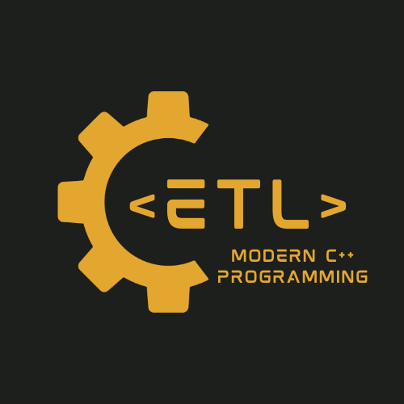

<div align="center">
  
</div>
<div align="center">
  
  <br>
  <p><b>Extra Templated Library</b> for modern C++ development</p>
</div>


## Table of Contents

- [Install](#install)
- [CmakeUsage](#cmakeusage)
- [Usage](#usage)
- [API](#api)
- [Maintainers](#maintainers)
- [Contributing](#contributing)
- [License](#license)

## Install

### Add to your project directly (manual way)

[Copy the single header file](extra-template-library/etl/include/etl.hpp) into your project.

Or you can download the `etl.hpp` file from the latest [Releases](https://github.com/thebashpotato/extra-template-library/releases)

### The global manual way

Will install the single header file and Cmake configuration modules

``` bash
make install

# Example output
-- Install configuration: "Release"
-- Up-to-date: /usr/local/include
-- Up-to-date: /usr/local/include/etl.hpp
-- Installing: /usr/local/share/pkgconfig/etl.pc
-- Installing: /usr/local/share/cmake/etl/etlConfigVersion.cmake
-- Installing: /usr/local/share/cmake/etl/etlConfig.cmake
```

To remove on linux (relies on xargs)
``` bash
make uninstall
```

## CmakeUsage

### CPM (The package manager way)

Please check out how to use [CPM](https://github.com/cpm-cmake/CPM.cmake) it is dead simple.

```cmake
cpmaddpackage(
  NAME
  etl
  GITHUB_REPOSITORY
  thebashpotato/extra-template-library
  VERSION
  0.5.0)

if(etl_ADDED)
  message(STATUS "Extra Template Library added")
  add_library(etl::etl INTERFACE IMPORTED)
  target_include_directories(etl::etl INTERFACE ${etl_SOURCE_DIR}/etl/include)
endif()


# Your Application linking cmake code
target_link_libraries(
  your_awesome_project
  PRIVATE etl::etl)
```

### Find Package

```cmake 
find_package(etl 0.5.0 REQUIRED)

# Your Application linking cmake code
target_link_libraries(
  your_awesome_project
  PRIVATE etl::etl)
```


### Package Config

```cmake
find_package(PkgConfig REQUIRED)
pkg_check_modules(etl REQUIRED etl)

# Your Application linking cmake code
target_link_libraries(your_awesome_project PUBLIC ${etl_LIBRARIES})
target_include_directories(your_awesome_project PUBLIC ${etl_INCLUDE_DIRS})
```

## Usage

[Please see the unit tests](extra-template-library/etl/tests) for examples for each class.
[Please see the example](extra-template-library/etl/examples/blackjack.cpp) for an example blackjack program utilizing the classes to solve real world problems.


```cpp
#include <etl.hpp>
```

## API

TODO

## Maintainers

[@thebashpotato](https://github.com/thebashpotato)

## Contributing

PRs accepted.

Small note: If editing the README, please conform to the [standard-readme](https://github.com/RichardLitt/standard-readme) specification.

## License

MIT © 2023 Matt Williams
